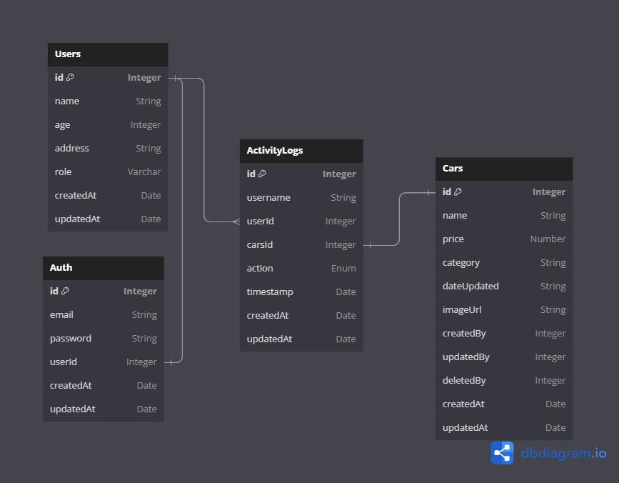

<h1 align="center">Car Management API</h1>

## About The Project

This project creates a Car management API which includes several APIs for admin and member registration and there is also an API for superadmin, admin and member login. In this project there is also an API for adding, displaying, updating and deleting car data. which can only be done by superadmin and admin, and members can only register, log in and see the car list.

##### Entity Relationship Diagram



## Build With


<!-- GETTING STARTED -->

## Getting Started

To start developing this project, follow the steps below:

### Prerequisites

The first requirement before starting to develop this project is that you must first initialize npm using the method below

- npm
  ```sh
  npm init
  ```

### Installation

After initializing you have to do the installation below

1. Clone the repo
   ```sh
   git clone https://github.com/NARajab/Car-Management-API.git
   ```
2. Install node packages
   ```sh
   npm install
   ```
3. Create .env file then copy the variables from .env.example then paste them into file .env

4. install dotenv packages
   ```sh
   npm install dotenv
   ```
5. install sequelize-cli packages
   ```sh
   npm install sequelize-cli
   ```
6. initialitation sequelize
   ```sh
   npx sequelize init
   ```
7. create database
   ```sh
   npx sequelize db:create
   ```
8. migration database
   ```sh
   npx sequelize db:migrate
   ```
9. run the seeder
   ```sh
   npx sequelize db:seed:all
   ```
10. Run the program with npm
    ```sh
    npm run dev
    ```
11. Open a browser and enter http://localhost:PORT

### The APIs that can be opened in this challenge are as follows:

#### Superadmin data

```
1. email: nur@gmail.com
   password: nur123
2. email: ali@gmail.com
   password: ali123
3. email: rajab@gmail.com
   password: rajab123
```

#### OpenAPI Documentation Page

```
http://localhost:PORT/api-docs
```

### Notes

- Admin registration can only be done by Superadmin
- create car, update car and delete car can only be done by Superadmin and Admin
- Editing and deleting users can only be done by Superadmin
